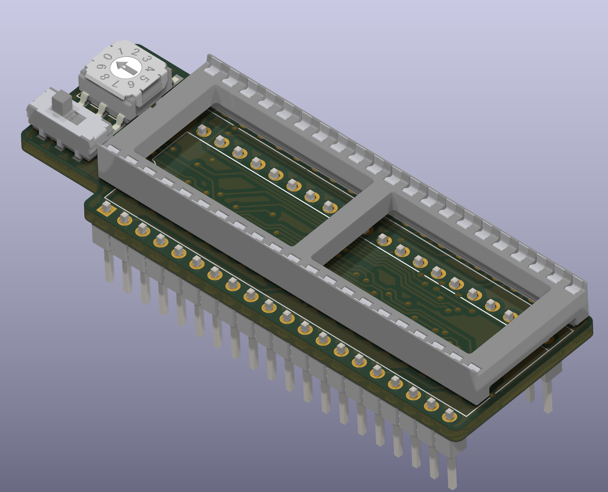

# tl866_27c322_adapter
A small footprint adapter that can be used for programming 27C* type EEPROMs on a TL866 II programmer. This programmer is abundantly available and cheap but does not support DIP packages larger than 2x20 pins. This adapter allows you to manually address the upper 3 bits of the memory so you can program these larger chips. Unlike some of the other cheaper adapters online, this one is very small, and uses a rotary bit switch to select the active bank with "true" code, so that you don't have to worry about switching the binary banks in the right order or with inverted output. 

